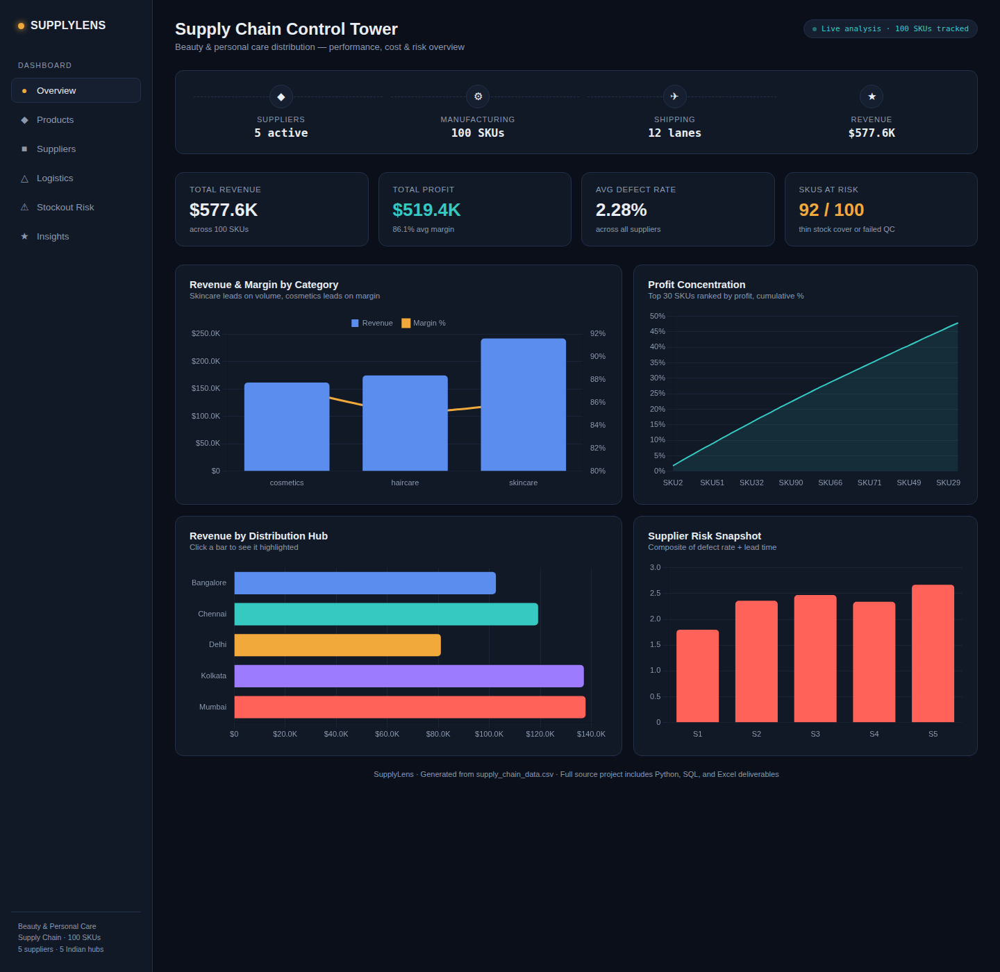
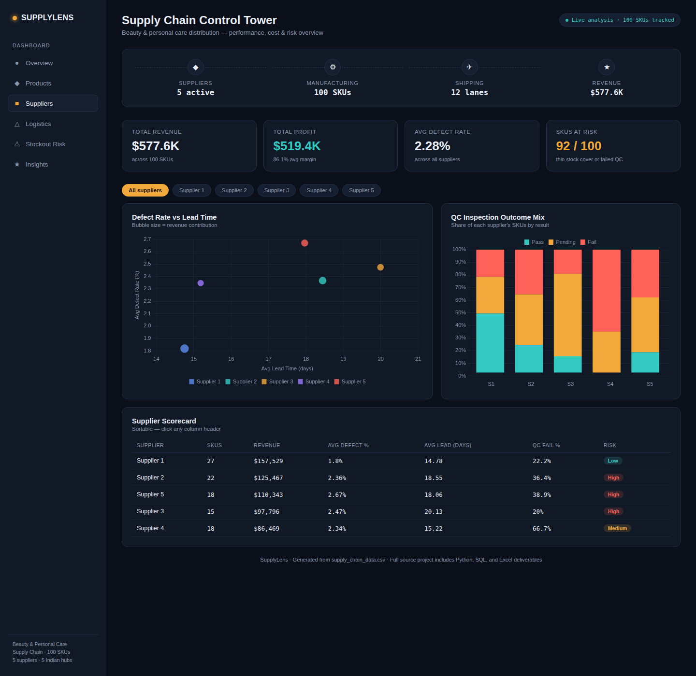
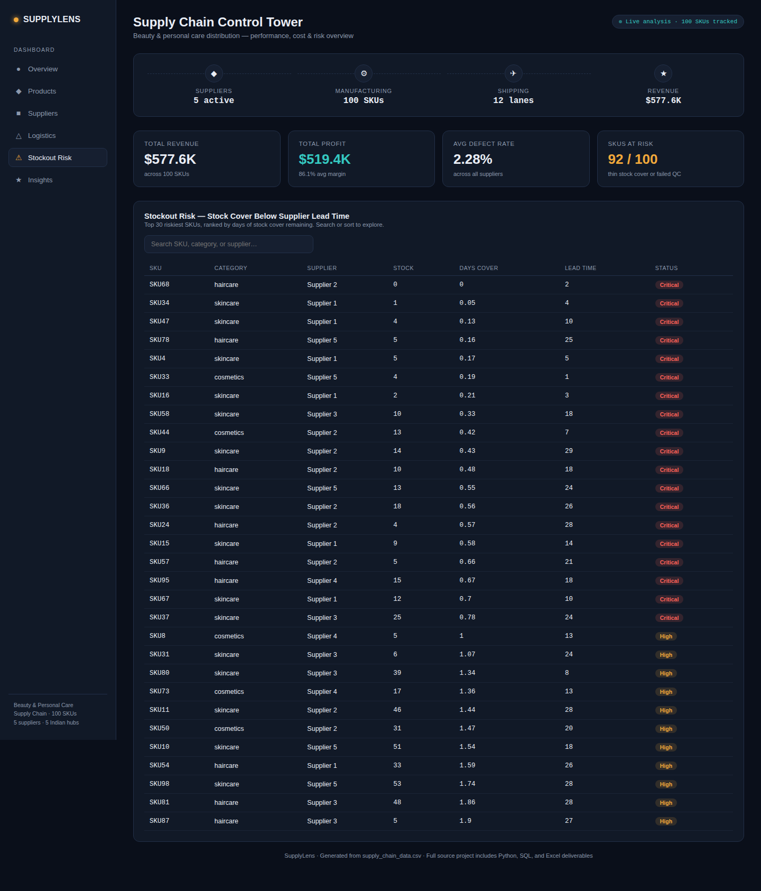
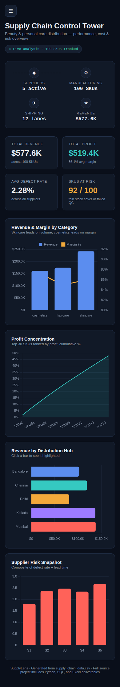

# Supply Chain Performance & Cost Analysis
### A full-stack data analyst project — Python, SQL, Excel, Power BI, and an AI-built interactive dashboard

**Dataset:** 100 SKUs of beauty & personal care products (skincare, haircare, cosmetics),
sold through 5 suppliers across 5 Indian distribution hubs (Mumbai, Delhi, Bangalore,
Chennai, Kolkata), with pricing, sales, quality/inspection, and logistics data.

---

## Dashboard preview

**Overview** — KPI cards, revenue/margin by category, profit concentration, revenue by hub, supplier risk snapshot


**Suppliers** — clickable filter chips, defect-rate vs lead-time scatter, QC inspection mix, sortable scorecard


**Stockout Risk** — searchable, sortable table of SKUs with thinner stock cover than supplier lead time


**Mobile** — fully responsive, single-column layout with slide-out nav


---

## What's in this project

```
supply-chain-project/
├── data/
│   ├── raw_data.csv              → original uploaded file
│   ├── cleaned_data.csv          → after cleaning + derived fields
│   ├── analyzed_data.csv         → after segmentation + risk scoring
│   ├── supplier_scorecard.csv
│   ├── segment_summary.csv
│   └── dashboard_data.json       → data feeding the HTML dashboard
├── python/
│   ├── 01_clean_profile.py       → load, clean, derive fields
│   ├── 02_analysis.py            → correlations, segmentation, supplier risk
│   ├── 03_visuals.py             → 5 matplotlib charts
│   └── 04_build_excel.py         → builds the Excel workbook
├── sql/
│   ├── analysis.db                → SQLite database (table: supply_chain)
│   └── queries.sql                → 10 business-question queries
├── visuals/                       → 5 PNG charts
├── excel/
│   └── analysis.xlsx              → 5-tab formula-driven workbook
├── powerbi/
│   ├── powerbi_data_model.csv     → ready to load into Power BI Desktop
│   └── POWERBI_GUIDE.md           → DAX measures + report-building steps
├── insights/
│   └── summary.md                 → 5 prioritized business insights
├── dashboard.html                 → interactive AI-built dashboard (open in any browser)
└── dashboard_template.html        → source template (data injected at build time)
```

## How each tool was used, and why

**Python (pandas)** did the heavy lifting for cleaning and multi-step analysis that's
awkward in SQL or Excel alone — deriving profit/margin fields, z-scoring suppliers
into a composite risk score, and generating the matplotlib chart set.

**SQL (SQLite)** answers the kind of ad-hoc business questions a stakeholder would
actually ask — "which category makes the most money," "which supplier is riskiest,"
"where is profit concentrated" — using GROUP BY, window functions (RANK, running
totals), and CTEs. This is the layer most transferable to a real company's data
warehouse.

**Excel** is the deliverable a non-technical stakeholder opens first. Every number
in it is a formula referencing the Raw Data tab (not hardcoded), so it updates if the
underlying data changes — a Summary front page, a Raw Data table, and three
pivot-style analysis tabs with an embedded chart.

**Power BI** wasn't authored as a binary `.pbix` here (Power BI Desktop isn't
available in this environment), but `powerbi/POWERBI_GUIDE.md` gives you the exact
DAX measures and report layout to reproduce the same analysis natively in Power BI in
under 15 minutes — this is the layer built for live, filterable, multi-user
dashboards inside an organization.

**The interactive HTML dashboard** (`dashboard.html`) is the "AI-powered, attractive,
responsive, clickable" piece — a dark, data-forward control-tower interface with:
- Sidebar navigation across 6 views (Overview, Products, Suppliers, Logistics, Risk, Insights)
- Filter chips on the Suppliers page that cross-filter the scorecard table
- Sortable table headers (click any column) on the Supplier Scorecard and Stockout Risk tables
- A live search box on the Stockout Risk table
- Fully responsive layout — collapses to a single column with a slide-out nav menu on mobile
- All charts (Chart.js) are dynamic, generated from the same underlying dataset as the Excel workbook and SQL queries

Open `dashboard.html` directly in any browser — no server needed.

## Key business insights (see `insights/summary.md` for full detail)

1. **Category mix** — Skincare drives the most revenue ($241.6K), but Cosmetics has
   the best average margin (87.3%) with the fewest SKUs — a candidate for expansion.
2. **Supplier risk** — Supplier 3 has the slowest lead times (20.1 days avg);
   Supplier 4 has a hidden QC problem (67% inspection fail rate) masked by a
   mid-pack average defect rate.
3. **Logistics cost** — Carrier C + Road costs 69% more per shipment than Carrier A
   + Sea with no speed advantage — a clear cost-cutting target.
4. **Profit concentration** — The top 20 SKUs (20% of the catalog) generate ~33% of
   total profit and deserve prioritized inventory attention.
5. **Stockout risk** — 92 of 100 SKUs carry less stock cover than their own
   supplier's lead time — the single biggest operational risk in the dataset.

## How to reproduce or extend this

- Re-run `python/01_clean_profile.py` → `02_analysis.py` → `03_visuals.py` →
  `04_build_excel.py` in order if the source CSV changes.
- Re-run `python3 /mnt/skills/public/xlsx/scripts/recalc.py excel/analysis.xlsx 60`
  after any Excel formula change to force LibreOffice to recalculate before opening
  in Excel.
- To refresh the HTML dashboard, regenerate `data/dashboard_data.json` and re-inject
  it into `dashboard_template.html` to produce a new `dashboard.html`.
